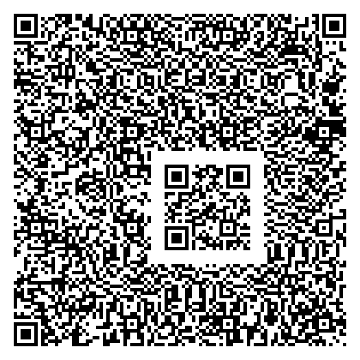

# QR Code in QR Code

Here's a QR Code whose contents contain a smaller QR Code!

The outer QR Code decodes to "**I AM A BIG QR CODE...**" and the inner QR Code decodes to "**I AM A SMALL QR CODE!**".

This isn't like those QR Codes with a logo, where the underlying cells are missing and recovered during error correction. In this case, the image above is **exactly** what you would get if you took the decoded text and [passed it through any standard QR Code encoder that complies with the spec (using **Low** error correction mode)](https://gchq.github.io/CyberChef/#recipe=Generate_QR_Code('PNG',5,4,'Low')&input=SSBBTSBBIEJJRyBRUiBDT0RFLiBIRVJFIElTIFNPTUUgREFUQTogQ0E5NzBUQVEgN1E0JUY3SkxTOUk4KldBWExMKlE3UTRIRUJILUZJOVc6LSUgJUxOLTlZOklLR09UMlJHODI5Nkw6VDdRWDlFOEY3QzpYUVpBWDhRUkNLUDdGRlVMMC40LVAqSkMgT1ZQRFpaR1E5IDZRVkglSkozLzpRM0VINlo6QzcxM1RZOFZQLTRFRjhRVSUrVjAgU0w5MDQvQU8vRFBJQkkgVU1TKkY1UDExLzlBWUNNVkY4M0lVQ1UuTiQ4SyskRFo3JUNWMUw3TjVRTjkzVjclTi84TlAvLi5XWE9GSDFMK0ZDMCs4JVdDRFQyQklDS00wUVFOOC86NFIwUEoxUDdVLjZUTkcqUUElV1VQMitRWEhGNlZNLzBDVjUxM0JWSUE0T1E2MyVXQTVLQTVMRks5ME1GTStFQjkgK1FPTkpWUUY3OiAwT0JHWTlNUDZPWjklTkROTjI4SVVOQjggRStORjdPNjNBMy1JTTFCMTpLS0ZRRkIvTjFYUE43UTQvM1pKRyQxOlM2NDFZTjNKRCpRUjQ6IFotSTY1SSo3TUNNVUlRUk46Mk1PJFBHLkpCWFdSSkkySUpNVlEqUzQwT0UgLiBJOlU5NFctNCBHMiRSUllQTlIzWUZCKjNKRUVRMUEgTVVUSkU6S0hXVVRFUi9CSCpaRiVaRTpZL1FCUFBLTlElWU9SLSAzNVglOkhTLjdFOlA4Ny9VSVdQM1kqQkctVi5RVUhYTSpOJCVDRjlKM1guTUVBVVpBMkI1M00kRVFSRVZYICVSUS5VR1EwNUxVTVJPTiArSlpMWTpFSzNLLTZaUzkrVTRQVEM3KzlFRUlaWlozWC8rIEY3L1AgKi9ULzJYTDpGOEpRM0xOT1BQQ0xFL1NCTUc5N0gwMDE4S1kkLVdMTVZRWE8wLytNQ0kvRSVPVEQrUDNRNCBWQ0IzTk4rJTJKS0ZPJTdTMypISFZUVEU3OUdGMVUxRk1IU1glV0FLJTpKRDdWJFIlSSRYMEtSNjc5RTggTVZBTTFHTy5LLiRSTVRVNkZaRUQ2KkNNVUcgVEhIVTQkV1AvUVYvUyA3OCA0RzAzM01BIElRSFItNk9STy0yT0FWJTBLJCBKRjYxNjU2OU5WUFAwQiowN0Y1MEYwNFpEWkktUlpDREc2JUskKlY0KjhOTCUzJEowTy9FIDNDUi9ZNjhIRjkkWTdMMFMzTDouOFBHKzg0TlNIVjYrQ0tGMSpaTlhSMk4kUkRLICtIVk9KTEQlLzZCUyRIVURCUSBOUiskLVpCTVArN1c0TStXRC9WVDZLNDA0SiQgMkJKM1pOQzU4M0U5V0VRN1NJNTIwMDEgTzAuWTRJJTVJVDQxOEtUTSskTTBFMTdTR01DJVE0QlJUMlczWFY5OktEOi5aLlZRVE5WSi46VSRVUzc4S00yLllPLUwuRC0rSStSTE5DSzBEUlZIUCtSWktSRVg5SDdGOTBQVUY4MlJIK1g4VUQvNERFWjVWSUhaMyBYLypSQTE5VUhCSCBPWjgrN1NISCVWLjkrNk06VkokTlRUTEUlVUJOOTc6WUZaNVMuOEUxTkckRU5HTlQgLjpVOk01VFFCTFIrIFZZOEou).

### Details

Embedding a QR Code within another isn't trivial, because:

1. QR Codes contain alignment patterns in fixed positions that can't be changed.
2. Not all combinations of the remaining QR Code modules are valid.
3. The spec requires a mask that minimizes "bad patterns." The finder patterns of the inner QR Code, and the large whitespace around it (a 4-cell border is required by the spec), are heavily penalized patterns. A compliant encoder would typically choose a different mask to avoid them.

For (1): The alignment patterns are the 5x5 squares with black borders and a black center cell. There's not enough space between the outer QR Code's alignment patterns to fully embed an inner QR Code. However, we can align (haha) one of the inner QR Code's alignment patterns with one of the outer QR Code's, and place the rest of the inner QR Code around it.

For (2): We avoid overlapping the error correction regions of the outer QR Code when placing the inner one. We also use **Alphanumeric** encoding mode, which has a higher ratio of valid characters than **Byte** mode, so that the outer QR Code still decodes successfully.

For (3): There are 8 possible masking patterns. Strips of finder patterns are penalized heavily (40 points each), so we sprinkle strips of finder patterns throughout the rest of the outer QR Code with the 7 masks we don't want. This forces the encoder to choose the mask with the least penalty, the one that gives the small QR Code.

The `main.py` script generates the encoded data for the outer QR Code.

